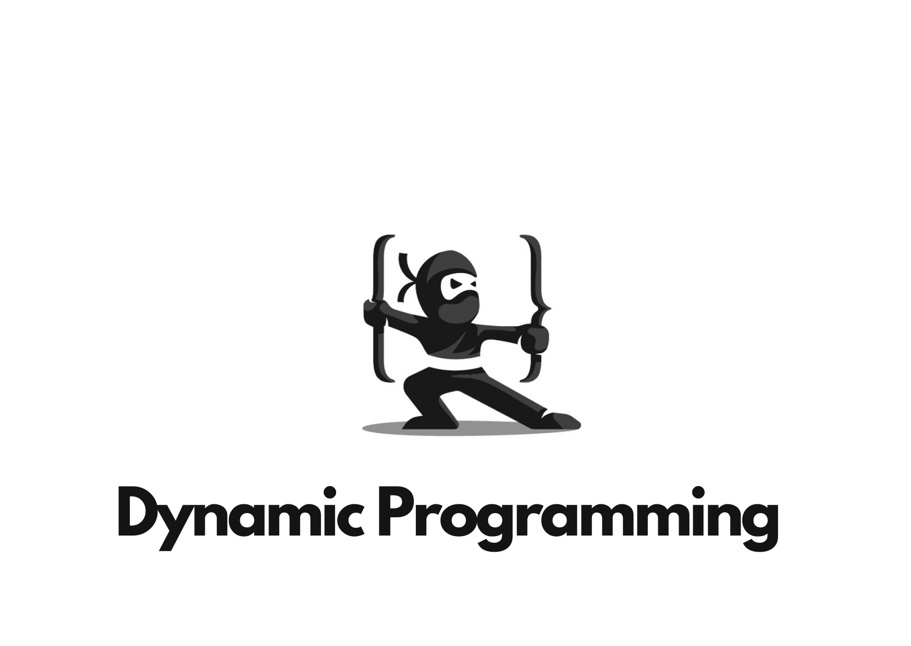

<h1 align="center">Repository for Dynamic Programming Questions and it's Code.</h1>

<h2>Questions included in this:- <h2>

1. Knapsack Recursive
2. Knapsack Memoization
3. Knapsack Top Down DP
4. Subset Sum Problem 
5. Equal Sum Partition Problem
6. Count of Subset Sum with Given Sum
7. Minimum Subset Sum Difference
8. Count the no. of Subset with a given difference
9. Target Sum
10. Unbounded Knapsack 
11. Rod Cutting Problem 
12. Coin Change Problem - Maximum No. of Ways
13. Coin Change Problem - Minimum No. of Coins
14. Longest Common Subsequence Problem - Recursive, Memoization & Top Down Approach
15. Length of Longest Common **Substring**
16. Printing Longest Common Subsequence
17. Shortest Common Supersequence
18. Minimum Number of Insertion and Deletion to convert String a to String b
19. Printing shortest common Supersequence
20. Longest repeating subsequence
21. Sequence Pattern Matching
22. Minimum number of insertion in a string to make it a Palindrome
23. Matrix Chain Multiplication - Recursive & Memoization
24. Palindrome Partitioning
25. Evaluate Boolean Expression to True - Recursive
26. Evaluate Boolean Expression to True - Memoization
27. Scramvled String - Memoization
28. Egg Drop Problem - Memoization
